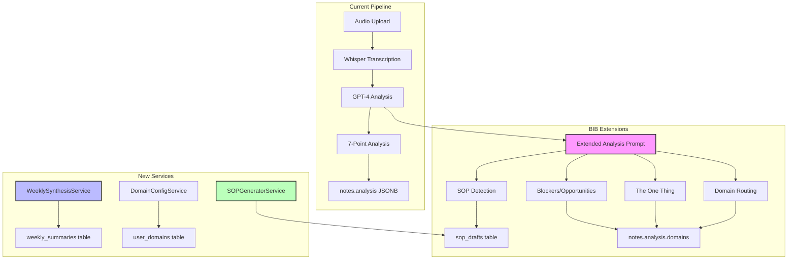
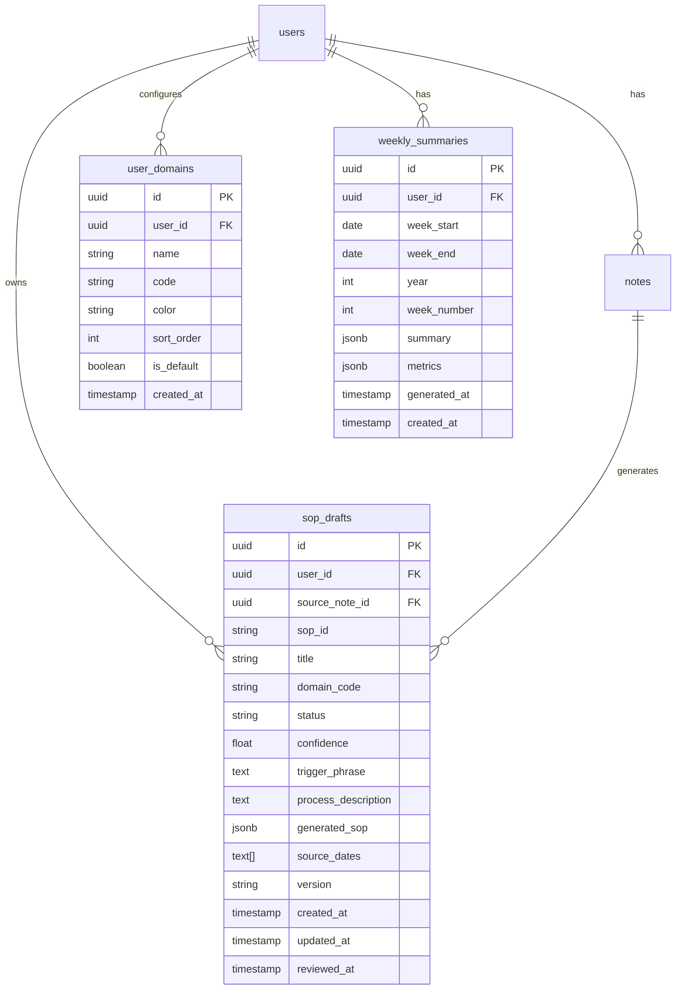

# feat: Business-in-a-Box Features for Voice Memory

## Overview

Transform Voice Memory into a compounding knowledge system by adding Business-in-a-Box (BIB) features that make each voice note more valuable than the last. These features convert rambling audio into structured intelligence that feeds a self-improving knowledge engine.

## Problem Statement / Motivation

Currently, Voice Memory provides excellent transcription and 7-point analysis, but lacks:
1. **Process codification** - No automatic detection of repeatable processes (SOPs)
2. **Domain organization** - All items are flat; no categorization by business area
3. **Temporal synthesis** - No weekly/monthly aggregation of insights
4. **Priority focus** - No "One Thing" extraction to identify daily priorities
5. **Obstacle tracking** - Blockers and opportunities aren't explicitly tracked

The Business-in-a-Box master plan solves these gaps with a **Capture → Process → Store → Act → Evolve** cycle.

## Proposed Solution

Extend the existing 7-point analysis with 5 new BIB features:

### Feature 1: SOP Detection & Generation
Automatically detect process descriptions in voice notes and generate draft SOPs.

### Feature 2: Domain Routing
Categorize extracted items into user-customizable domains.

### Feature 3: Weekly Synthesis
Auto-generate weekly summaries from daily voice notes.

### Feature 4: "The One Thing" Extraction
Identify the single most important priority from each recording.

### Feature 5: Blocker/Opportunity Tracking
Explicit fields for obstacles and opportunities mentioned.

---

## Technical Approach

### Architecture



### Database Schema Changes



---

## Implementation Phases

### Phase 1: Extended Analysis Schema (Foundation)

**Goal:** Extend GPT-4 analysis prompt to extract BIB fields without breaking existing functionality.

**Tasks:**

- [ ] **1.1** Update `lib/analysis.ts` - Add new fields to analysis prompt
  - `theOneThing`: { description, domain, why_important }
  - `domains`: Array of domain tags for each extracted item
  - `blockers`: [{ description, severity, domain, potential_solutions }]
  - `opportunities`: [{ description, domain, time_sensitivity, next_action }]
  - `sopCandidates`: [{ trigger_phrase, process_description, confidence, suggested_title }]

- [ ] **1.2** Update `lib/validation.ts` - Extend Zod schema for new fields
  - Add validation for all new BIB fields
  - Make new fields optional for backward compatibility
  - Add fallback defaults for missing fields

- [ ] **1.3** Update `lib/types.ts` - Add TypeScript interfaces
  - `TheOneThing` interface
  - `Blocker` interface
  - `Opportunity` interface
  - `SOPCandidate` interface
  - Extend `NoteAnalysis` with new fields

- [ ] **1.4** Test with existing notes
  - Verify backward compatibility
  - Process test audio with new prompt
  - Validate JSON structure

**Files to Modify:**
- `lib/analysis.ts:1-200` (analysis prompt)
- `lib/validation.ts:1-150` (Zod schema)
- `lib/types.ts:1-100` (TypeScript types)

**Acceptance Criteria:**
- [ ] New analysis fields extracted correctly
- [ ] Existing 7-point analysis unchanged
- [ ] All tests pass
- [ ] No breaking changes to existing notes

---

### Phase 2: Domain Configuration System

**Goal:** Allow users to configure custom domains for categorization.

**Tasks:**

- [ ] **2.1** Create database migration `20250127_user_domains.sql`
  ```sql
  CREATE TABLE user_domains (
    id UUID PRIMARY KEY DEFAULT gen_random_uuid(),
    user_id UUID REFERENCES users(id) ON DELETE CASCADE,
    name TEXT NOT NULL,
    code TEXT NOT NULL,
    color TEXT DEFAULT '#6B7280',
    sort_order INTEGER DEFAULT 0,
    is_default BOOLEAN DEFAULT false,
    created_at TIMESTAMP DEFAULT NOW(),
    UNIQUE(user_id, code)
  );

  -- Default domains seeded on user creation
  CREATE OR REPLACE FUNCTION seed_default_domains()
  RETURNS TRIGGER AS $$
  BEGIN
    INSERT INTO user_domains (user_id, name, code, color, sort_order, is_default) VALUES
      (NEW.id, 'Work', 'WORK', '#1E40AF', 1, true),
      (NEW.id, 'Personal', 'PERS', '#6B7280', 2, true),
      (NEW.id, 'Projects', 'PROJ', '#047857', 3, true),
      (NEW.id, 'Ideas', 'IDEA', '#7C3AED', 4, true);
    RETURN NEW;
  END;
  $$ LANGUAGE plpgsql;
  ```

- [ ] **2.2** Create `lib/services/DomainConfigService.ts`
  - CRUD operations for user domains
  - Get domains with usage stats
  - Validate domain codes in analysis

- [ ] **2.3** Create API endpoints
  - `GET /api/domains` - List user's domains
  - `POST /api/domains` - Create custom domain
  - `PUT /api/domains/[id]` - Update domain
  - `DELETE /api/domains/[id]` - Delete domain (reassign items)

- [ ] **2.4** Create Domain Settings UI component
  - `app/components/DomainSettings.tsx`
  - Domain list with color pickers
  - Add/edit/delete domains
  - Reorder via drag-and-drop

**Files to Create:**
- `supabase/migrations/20250127_user_domains.sql`
- `lib/services/DomainConfigService.ts`
- `app/api/domains/route.ts`
- `app/api/domains/[id]/route.ts`
- `app/components/DomainSettings.tsx`

**Acceptance Criteria:**
- [ ] Default domains seeded for new users
- [ ] Users can add/edit/delete custom domains
- [ ] Domain colors display in UI
- [ ] Analysis uses user's domain list for categorization

---

### Phase 3: SOP Detection & Generation

**Goal:** Detect process descriptions and generate draft SOPs automatically.

**Tasks:**

- [ ] **3.1** Create database migration `20250127_sop_drafts.sql`
  ```sql
  CREATE TABLE sop_drafts (
    id UUID PRIMARY KEY DEFAULT gen_random_uuid(),
    user_id UUID REFERENCES users(id) ON DELETE CASCADE,
    source_note_id UUID REFERENCES notes(id) ON DELETE SET NULL,
    sop_id TEXT NOT NULL,
    title TEXT NOT NULL,
    domain_code TEXT,
    status TEXT DEFAULT 'draft' CHECK (status IN ('draft', 'review', 'active', 'deprecated')),
    confidence DECIMAL(3,2) CHECK (confidence >= 0 AND confidence <= 1),
    trigger_phrase TEXT,
    process_description TEXT,
    generated_sop JSONB,
    source_dates TEXT[],
    version TEXT DEFAULT '1.0.0',
    created_at TIMESTAMP DEFAULT NOW(),
    updated_at TIMESTAMP DEFAULT NOW(),
    reviewed_at TIMESTAMP,
    UNIQUE(user_id, sop_id)
  );

  CREATE INDEX idx_sop_drafts_user_status ON sop_drafts(user_id, status);
  CREATE INDEX idx_sop_drafts_confidence ON sop_drafts(confidence DESC);
  ```

- [ ] **3.2** Create `lib/services/SOPGeneratorService.ts`
  - `detectSOPCandidates(analysis)` - Extract from analysis
  - `generateSOPDraft(candidate)` - Call GPT-4 to generate full SOP
  - `findMatchingSOPs(description)` - Match against existing SOPs
  - `calculateConfidence(candidate)` - Score based on triggers

- [ ] **3.3** Update `AnalysisProcessorService.ts`
  - After analysis, check for SOP candidates with confidence > 0.6
  - Create draft SOPs automatically
  - Link to source note

- [ ] **3.4** Create SOP management UI
  - `app/components/SOPDraftList.tsx` - List pending drafts
  - `app/components/SOPViewer.tsx` - View/edit SOP
  - `app/components/SOPReviewQueue.tsx` - Review and approve drafts

- [ ] **3.5** Create API endpoints
  - `GET /api/sops` - List SOPs with filters
  - `GET /api/sops/drafts` - List pending drafts
  - `POST /api/sops/[id]/approve` - Move to active
  - `PUT /api/sops/[id]` - Update SOP content

**SOP Detection Triggers** (in analysis prompt):
| Trigger Type | Example Phrases | Confidence Boost |
|-------------|-----------------|------------------|
| Explicit | "Here's the process for...", "The way I do this is..." | +0.3 |
| Procedural | "First..., then..., finally..." | +0.2 |
| Teaching | "If someone else needs to do this..." | +0.35 |
| Correction | "Actually, the better way is..." | +0.25 |

**Files to Create:**
- `supabase/migrations/20250127_sop_drafts.sql`
- `lib/services/SOPGeneratorService.ts`
- `app/api/sops/route.ts`
- `app/api/sops/drafts/route.ts`
- `app/api/sops/[id]/route.ts`
- `app/api/sops/[id]/approve/route.ts`
- `app/components/SOPDraftList.tsx`
- `app/components/SOPViewer.tsx`

**Acceptance Criteria:**
- [ ] SOP candidates detected with confidence scores
- [ ] Drafts auto-generated for confidence > 0.6
- [ ] Users can review, edit, and approve drafts
- [ ] Version tracking on SOP updates

---

### Phase 4: Weekly Synthesis

**Goal:** Auto-generate weekly summaries from daily voice notes.

**Tasks:**

- [ ] **4.1** Create database migration `20250127_weekly_summaries.sql`
  ```sql
  CREATE TABLE weekly_summaries (
    id UUID PRIMARY KEY DEFAULT gen_random_uuid(),
    user_id UUID REFERENCES users(id) ON DELETE CASCADE,
    week_start DATE NOT NULL,
    week_end DATE NOT NULL,
    year INTEGER NOT NULL,
    week_number INTEGER NOT NULL,
    summary JSONB NOT NULL,
    metrics JSONB,
    generated_at TIMESTAMP DEFAULT NOW(),
    created_at TIMESTAMP DEFAULT NOW(),
    UNIQUE(user_id, year, week_number)
  );

  CREATE INDEX idx_weekly_summaries_user_week ON weekly_summaries(user_id, year DESC, week_number DESC);
  ```

- [ ] **4.2** Create `lib/services/WeeklySynthesisService.ts`
  - `generateWeeklySummary(userId, weekStart, weekEnd)`
  - `aggregateAnalyses(notes[])` - Combine 7 days of analyses
  - `synthesizeWithGPT(aggregated)` - Generate narrative summary
  - `calculateMetrics(notes[])` - Task completion, themes, etc.

- [ ] **4.3** Create synthesis prompt in `lib/weekly-synthesis.ts`
  ```typescript
  const WEEKLY_SYNTHESIS_PROMPT = `
  Synthesize this week's daily audio analysis into a comprehensive summary.

  Output Format:
  {
    "executive_summary": "3-5 sentence narrative",
    "top_themes": [{ theme, frequency, trend, insight }],
    "the_one_thing_patterns": ["recurring priorities"],
    "task_metrics": { created, completed, carried_over, completion_rate },
    "blockers_summary": { resolved, ongoing, new },
    "opportunities_pipeline": { acted_on, pending, expired },
    "sop_activity": { new_drafts, updates_flagged, approved },
    "momentum_highlights": ["top 3-5 wins"],
    "next_week_focus": ["top 3 priorities"],
    "domain_breakdown": { domain: { tasks, blockers, wins } }
  }
  `;
  ```

- [ ] **4.4** Create scheduled job (Vercel Cron or manual trigger)
  - Run Sunday evening or Monday morning
  - Process all users with notes in past week
  - Store in `weekly_summaries` table

- [ ] **4.5** Create Weekly Summary UI
  - `app/components/WeeklySummary.tsx`
  - `app/weekly/page.tsx` - Weekly view page
  - Charts for metrics visualization

- [ ] **4.6** Create API endpoints
  - `GET /api/weekly` - Get current/past weekly summaries
  - `POST /api/weekly/generate` - Manually trigger generation
  - `GET /api/weekly/[year]/[week]` - Get specific week

**Files to Create:**
- `supabase/migrations/20250127_weekly_summaries.sql`
- `lib/services/WeeklySynthesisService.ts`
- `lib/weekly-synthesis.ts`
- `app/api/weekly/route.ts`
- `app/api/weekly/generate/route.ts`
- `app/api/cron/weekly-synthesis/route.ts`
- `app/components/WeeklySummary.tsx`
- `app/weekly/page.tsx`

**Acceptance Criteria:**
- [ ] Weekly summaries generated automatically
- [ ] Metrics calculated correctly
- [ ] Theme trends identified
- [ ] Comparison to previous weeks available

---

### Phase 5: UI Integration & Polish

**Goal:** Integrate all BIB features into the existing UI.

**Tasks:**

- [ ] **5.1** Update NoteCard component
  - Show "The One Thing" badge prominently
  - Display domain tags with colors
  - Show blocker/opportunity indicators
  - Link to detected SOP drafts

- [ ] **5.2** Create Dashboard widgets
  - `app/components/TheOneThingWidget.tsx` - Today's priority
  - `app/components/BlockersWidget.tsx` - Active blockers
  - `app/components/OpportunitiesWidget.tsx` - Pending opportunities
  - `app/components/SOPStatusWidget.tsx` - Draft SOPs needing review

- [ ] **5.3** Create filtered views
  - Filter notes by domain
  - Filter tasks by domain
  - View all blockers across notes
  - View all opportunities

- [ ] **5.4** Update navigation
  - Add Weekly view link
  - Add SOPs section
  - Add Domain settings

- [ ] **5.5** Mobile optimization
  - Ensure all new components are responsive
  - Test touch interactions

**Files to Modify/Create:**
- `app/components/NoteCard/` (existing, modify)
- `app/components/TheOneThingWidget.tsx`
- `app/components/BlockersWidget.tsx`
- `app/components/OpportunitiesWidget.tsx`
- `app/components/SOPStatusWidget.tsx`
- `app/components/DomainFilter.tsx`
- `app/page.tsx` (update dashboard)

**Acceptance Criteria:**
- [ ] All BIB features visible in UI
- [ ] Domain filtering works across views
- [ ] Mobile-friendly layout
- [ ] Performance maintained (<3s load time)

---

## Alternative Approaches Considered

### Option A: Separate BIB App
**Rejected because:** Would lose integration with existing transcription pipeline, duplicate infrastructure.

### Option B: n8n Orchestration (per BIB master plan)
**Deferred because:** Current architecture handles processing well; n8n adds operational complexity. Could be added later for advanced workflows.

### Option C: Obsidian Integration
**Deferred because:** Web-first approach serves mobile users better. Could add export-to-Obsidian feature later.

---

## Acceptance Criteria

### Functional Requirements
- [ ] SOP candidates detected with >70% accuracy
- [ ] Domain categorization applied to all extracted items
- [ ] Weekly summaries generated automatically
- [ ] "The One Thing" extracted from each recording
- [ ] Blockers and opportunities tracked explicitly

### Non-Functional Requirements
- [ ] Processing time increase <30% (current ~45s → max 60s)
- [ ] No breaking changes to existing notes
- [ ] Mobile-responsive UI for all new features
- [ ] API response times <500ms for reads

### Quality Gates
- [ ] Unit tests for all new services
- [ ] E2E tests for critical workflows
- [ ] TypeScript strict mode compliance
- [ ] Security review for new endpoints

---

## Success Metrics

| Metric | Target | Measurement |
|--------|--------|-------------|
| SOP Detection Precision | >70% | Valid drafts / Total candidates |
| Domain Accuracy | >85% | Correct categorization on sample |
| Weekly Summary Usefulness | Qualitative | User feedback |
| Processing Time Impact | <30% increase | Metrics tracking |
| Feature Adoption | >50% users | Analytics |

---

## Dependencies & Prerequisites

**Internal:**
- Existing OpenAI integration (GPT-4, Whisper)
- Supabase database access
- Processing service infrastructure

**External:**
- OpenAI API quota (increased token usage ~20%)
- Vercel cron jobs for weekly synthesis

---

## Risk Analysis & Mitigation

| Risk | Likelihood | Impact | Mitigation |
|------|------------|--------|------------|
| GPT-4 prompt too long | Medium | High | Chunked prompts, summarize first |
| SOP over-detection | Medium | Low | Confidence threshold tuning |
| Processing time increase | Medium | Medium | Parallel processing, caching |
| Backward compatibility | Low | High | Feature flags, gradual rollout |

---

## Resource Requirements

- **Development:** ~40-60 hours across 5 phases
- **Testing:** ~10-15 hours
- **OpenAI costs:** ~20% increase in API usage

---

## Future Considerations

1. **RAG Integration** - Use embeddings to link related content
2. **n8n Workflows** - External automation triggers
3. **Obsidian Export** - Markdown export for local vault
4. **Team Features** - Shared SOPs, domain templates
5. **Mobile App** - Native iOS/Android with offline support

---

## References & Research

### Internal References
- Analysis prompt: `lib/analysis.ts:1-200`
- Processing service: `lib/processing/ProcessingService.ts`
- Validation schema: `lib/validation.ts`
- Database queries: `lib/database/queries.ts`

### External References
- Business-in-a-Box Master Plan: `/Users/andykaufman/Library/Mobile Documents/com~apple~CloudDocs/Downloads/business-in-a-box-master-plan.md`
- OpenAI GPT-4 Best Practices: https://platform.openai.com/docs/guides/prompt-engineering

### Related Work
- Current 7-point analysis system
- Task management (pin/complete) system
- Knowledge aggregation feature
