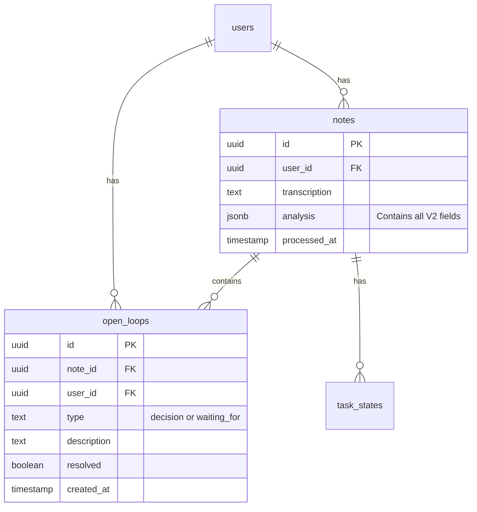

# feat: V2 ADHD-Optimized Voice Analysis Prompt (Simplified)

## Overview

Upgrade the Voice Memory analysis prompt with ADHD-optimized features: enhanced `theOneThing` with "why", time/energy estimates on tasks, and open loops tracking.

**Key Value Proposition**: Surface what actually matters for ADHD brains - the ONE most important thing, tasks matched to energy levels, and open loops (decisions + waiting-for) that drain mental bandwidth.

## Problem Statement

The current analysis extracts tasks but misses ADHD-critical metadata:
- **No "why"** for the priority task
- **No time estimates** - ADHD brains need to know task size
- **No energy matching** - Can't filter by current energy state
- **No open loops** - Decisions and waiting-for items aren't tracked

## Proposed Solution (Simplified)

Based on reviewer feedback, this plan has been aggressively simplified:

- **No new columns on `notes` table** - Keep everything in existing `analysis` JSONB
- **Single `open_loops` table** - Not two separate tables
- **No view needed** - Single table eliminates UNION complexity
- **No new service file** - Inline logic in existing processing
- **Two phases** - Backend + Frontend, not four phases

### Enhanced Analysis Structure

Extend the existing `NoteAnalysis` interface (keep in `analysis` JSONB):

```typescript
interface NoteAnalysis {
  // Existing fields (unchanged)
  summary: string;
  mood: 'positive' | 'neutral' | 'negative';
  topic: string;
  draftMessages: DraftMessage[];
  people: MentionedPerson[];
  recordedAt?: string;

  // Enhanced theOneThing
  theOneThing: {
    task: string;
    why: string;  // NEW: One sentence explaining priority
  } | null;

  // Enhanced tasks (title now enforces physical action via prompt)
  tasks: Array<{
    title: string;              // Prompt enforces "Open X and do Y" format
    urgency: 'NOW' | 'SOON' | 'LATER';
    domain: 'WORK' | 'PERS' | 'PROJ';  // Keep V1 domains
    estimatedMinutes?: 15 | 30 | 60 | 120;  // NEW
    energy?: 'low' | 'medium' | 'high';      // NEW
    context?: 'desk' | 'phone' | 'errand';   // NEW (simplified to 3)
  }>;

  // NEW: Open loops (extracted to separate table for resolution tracking)
  openLoops?: Array<{
    type: 'decision' | 'waiting_for';
    description: string;
  }>;

  // NEW: Note classification (stays in JSONB, not separate column)
  noteType?: 'brain_dump' | 'meeting_debrief' | 'planning' | 'venting' | 'idea_capture';
}
```

### Database Schema

**Single new table** (not two + view):

```sql
-- supabase/migrations/YYYYMMDD_open_loops.sql

CREATE TABLE open_loops (
  id UUID PRIMARY KEY DEFAULT gen_random_uuid(),
  note_id UUID REFERENCES notes(id) ON DELETE CASCADE,
  user_id UUID NOT NULL REFERENCES users(id) ON DELETE CASCADE,
  type TEXT NOT NULL CHECK (type IN ('decision', 'waiting_for')),
  description TEXT NOT NULL,
  resolved BOOLEAN DEFAULT FALSE,
  created_at TIMESTAMPTZ DEFAULT NOW()
);

CREATE INDEX idx_open_loops_user_unresolved ON open_loops(user_id) WHERE resolved = FALSE;

ALTER TABLE open_loops ENABLE ROW LEVEL SECURITY;
CREATE POLICY "Users see own open loops" ON open_loops FOR ALL USING (user_id = auth.uid());

GRANT ALL ON open_loops TO authenticated;
```

**That's it.** No new columns on `notes`. No view. No second table.

## Technical Approach

### Phase 1: Backend (1-2 days)

**Files to modify:**

| File | Action | Changes |
|------|--------|---------|
| `supabase/migrations/YYYYMMDD_open_loops.sql` | CREATE | Single table migration |
| `lib/analysis.ts` | MODIFY | Add V2 prompt alongside V1, version parameter |
| `lib/types.ts` | MODIFY | Extend `NoteAnalysis` with new optional fields |
| `lib/validation.ts` | MODIFY | Add optional field validation (permissive) |
| `lib/processing/AnalysisProcessorService.ts` | MODIFY | Store open loops after analysis |

**Key decisions:**
- Keep both V1 and V2 prompts, default new notes to V2
- Validation is permissive - accept fuzzy GPT output, default missing fields
- Store open loops inline in `processAnalysis()`, no separate service

### Phase 2: Frontend (1-2 days)

**Files to modify:**

| File | Action | Changes |
|------|--------|---------|
| `app/components/AnalysisView.tsx` | MODIFY | Show `theOneThing.why`, noteType badge |
| `app/components/EnhancedTaskList.tsx` | MODIFY | Show time/energy, add filter dropdowns |
| `app/components/OpenLoopsList.tsx` | CREATE | Simple list with resolve checkbox |

**Key decisions:**
- `TheOneThing` is just a styled section in `AnalysisView`, not separate component
- Open loops is a simple list, not a complex dashboard
- Filtering is basic dropdowns, not fancy faceted search

## Acceptance Criteria

### Must Have
- [ ] New notes get V2 analysis with `theOneThing.why`
- [ ] Tasks show estimated time and energy level when available
- [ ] Open loops extracted and stored in `open_loops` table
- [ ] Users can mark open loops as resolved
- [ ] V1 notes continue to display correctly

### Nice to Have (cut from MVP)
- [ ] ~~Context filtering~~ - Add later if users request
- [ ] ~~Energy-based task suggestions~~ - Add later if users request
- [ ] ~~Materialized view~~ - Premature optimization

### Quality
- [ ] V2 analysis completes within 5 minute timeout
- [ ] Migration tested on staging

## What Was Cut (and Why)

| Original Feature | Why Cut |
|------------------|---------|
| 5 new columns on `notes` | Data already in JSONB, no proven query need |
| Separate `decisions_needed` table | Single `open_loops` table is simpler |
| Separate `waiting_for` table | Single `open_loops` table is simpler |
| `open_loops` UNION view | Unnecessary with single table |
| `OpenLoopsService.ts` | Inline 10 lines of code, don't need a service |
| `urgencyReason` field | GPT inconsistent, not actionable |
| `blockedBy` field | Rarely populated |
| `detectedEnergy` field | Unreliable inference, user should set manually |
| `processingNotes` field | Interesting but not actionable |
| `stakeholders` array | Duplicates `people` array |
| `resolution` text field | Just delete resolved items |
| 6 context values | 3 is enough: desk, phone, errand |
| 5 time estimate values | 4 is enough: 15, 30, 60, 120 |
| 4 implementation phases | 2 is enough: backend, frontend |

## File Changes Summary

| File | Action | LOC Est |
|------|--------|---------|
| `supabase/migrations/YYYYMMDD_open_loops.sql` | CREATE | ~15 |
| `lib/analysis.ts` | MODIFY | ~50 (add V2 prompt) |
| `lib/types.ts` | MODIFY | ~20 (extend interface) |
| `lib/validation.ts` | MODIFY | ~15 (permissive validation) |
| `lib/processing/AnalysisProcessorService.ts` | MODIFY | ~20 (store open loops) |
| `app/components/AnalysisView.tsx` | MODIFY | ~30 (show new fields) |
| `app/components/EnhancedTaskList.tsx` | MODIFY | ~40 (time/energy display) |
| `app/components/OpenLoopsList.tsx` | CREATE | ~60 (simple list) |

**Total: ~250 LOC** (down from ~600+ in original plan)

## ERD (Simplified)



## References

### Source Files Provided
- `ANALYSIS_IMPLEMENTATION_GUIDE.md` - Original implementation guidance
- `analysis-prompt.ts` - V2 prompt definition

### Reviewer Feedback Incorporated
- DHH: "Keep data in JSONB, ship the simple thing"
- Kieran: "Remove denormalized columns, fix domain inconsistency"
- Simplicity: "Single table, 2 phases, ~45% LOC reduction"
